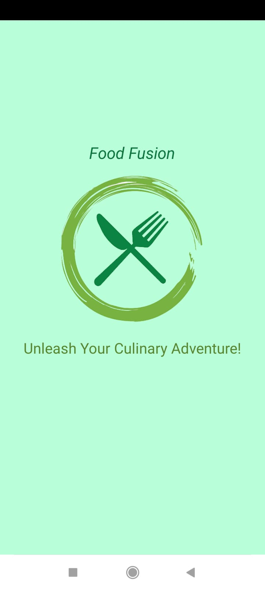
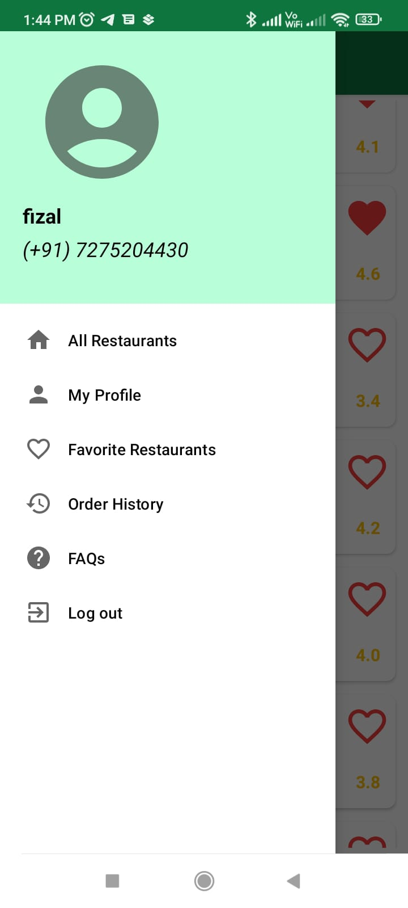
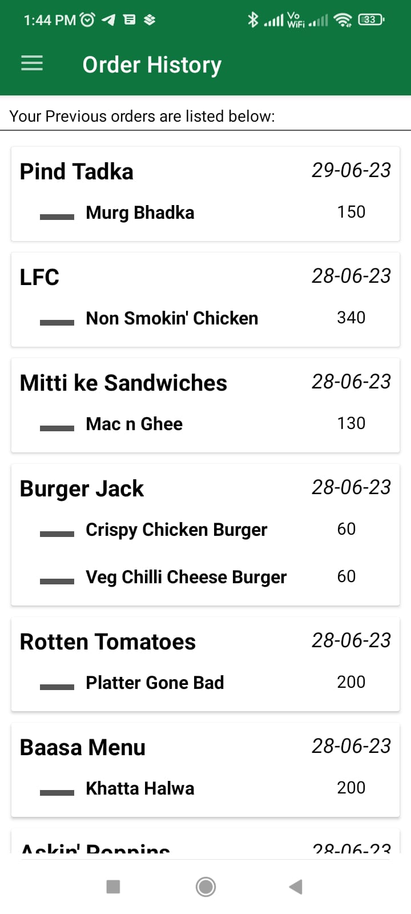
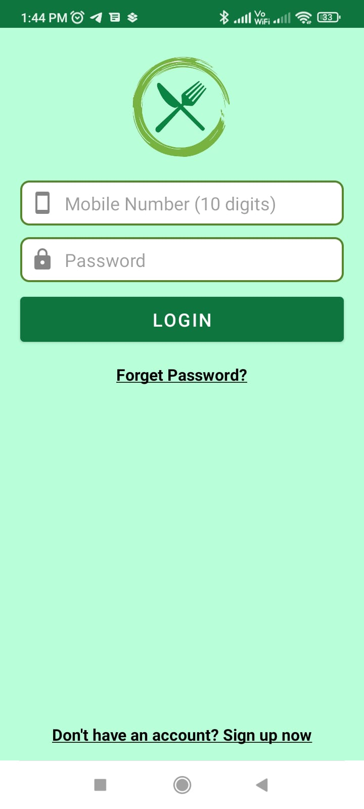
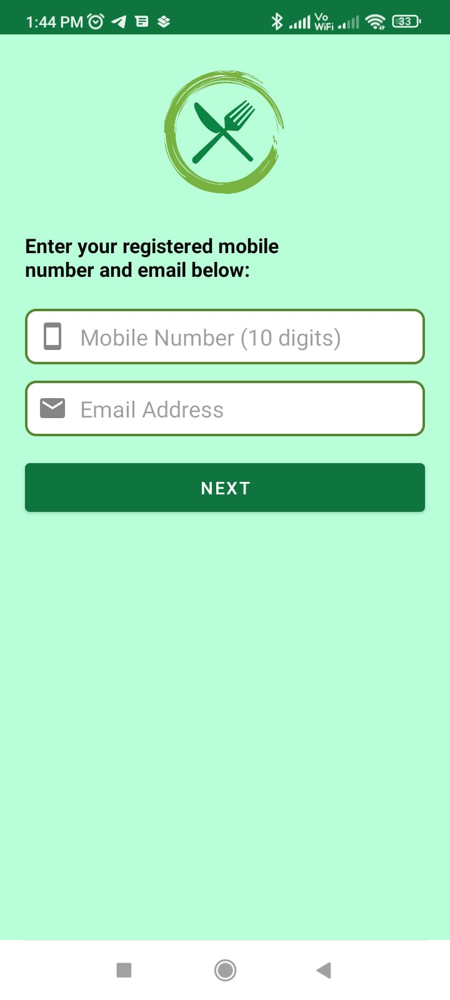
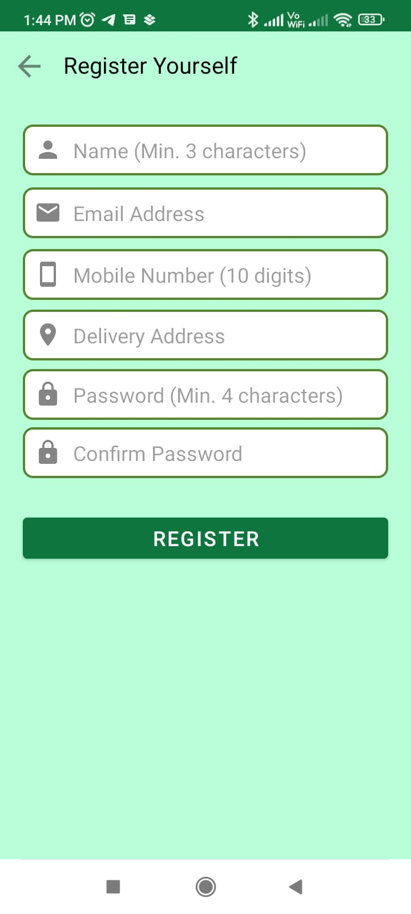

# Food Fusion Android App

Food Fusion is a comprehensive food application that offers a wide range of functionalities to enhance your culinary experience. From exploring recipes to meal planning and discovering new restaurants, Food Fusion is your one-stop solution for all things food-related. This README file provides an overview of the app and guides you on how to set it up and get started.

## Features

- **Recipe Search**: Browse through an extensive collection of recipes, search by ingredients, or explore popular categories.
- **Meal Planning**: Plan your meals for the week with a user-friendly meal planner and create customized menus.
- **Grocery List**: Automatically generate a shopping list based on your selected recipes and easily manage your grocery needs.
- **Restaurant Recommendations**: Discover nearby restaurants based on your location, cuisine preferences, and user ratings.
- **User Profiles**: Create and manage your personal profile, save favorite recipes, and track your cooking journey.
- **Social Sharing**: Share your favorite recipes, meal plans, and restaurant experiences with friends and family through integrated social media platforms.

## Screenshots

## Installation

To run the Food Fusion Android app, follow these steps:

1. Clone the repository: `git clone https://github.com/your-username/food-fusion.git`
2. Open the project in Android Studio.
3. Build the project to resolve dependencies and ensure a successful compilation.
4. Connect your Android device or emulator to the computer.
5. Click on the "Run" button in Android Studio to install and launch the app on your device/emulator.

Note: Make sure you have the latest version of Android Studio and the necessary SDKs installed.

## Usage

Upon launching the Food Fusion app, you will be greeted with a visually appealing and intuitive interface. Here's a brief overview of the app's main functionalities:

- **Recipe Search**: Use the search bar to find recipes based on keywords or ingredients. Browse the search results, view recipe details, and save your favorite recipes to your profile.

- **Meal Planning**: Access the meal planner section to create weekly meal plans. Select recipes from your saved favorites or search for new ones. Customize your menus and generate a shopping list.

- **Grocery List**: Check your shopping list, mark items as purchased, and remove or add items manually. Keep track of your grocery needs efficiently.

- **Restaurant Recommendations**: Explore the restaurant recommendation feature to find nearby dining options. Filter by cuisine type, ratings, and distance. Read reviews and get directions to your chosen restaurant.

- **User Profiles**: Create your own user profile within the app. Save your preferred recipes, track your cooking progress, and manage your preferences.

- **Social Sharing**: Share your culinary adventures by easily posting recipes, meal plans, or restaurant experiences to your favorite social media platforms.

## Contributing

We welcome contributions from the community to enhance the Food Fusion app. If you encounter any bugs, have feature suggestions, or want to contribute code improvements, please follow these steps:

1. Fork the repository.
2. Create a new branch for your feature or bug fix: `git checkout -b my-feature`.
3. Make the necessary changes and commit them: `git commit -m 'Add some feature'`.
4. Push your branch to your forked repository: `git push origin my-feature`.
5. Open a pull request in the original repository, describing your changes in detail.

Please ensure that your contributions align with our code of conduct and coding standards.

## License

The Food Fusion Android app is licensed under the [MIT License](LICENSE).

## Contact

If you have any questions, suggestions, or need assistance, please contact by creating issue on this project.

Thank you for using Food Fusion, and we hope you enjoy your culinary journey with our app!